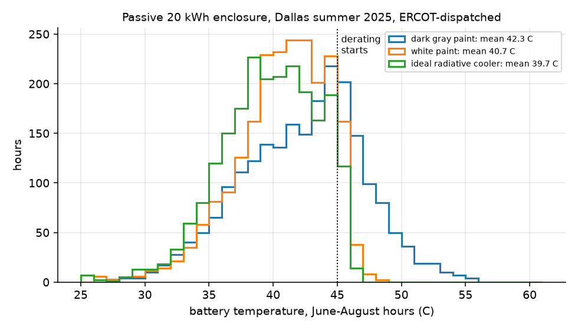
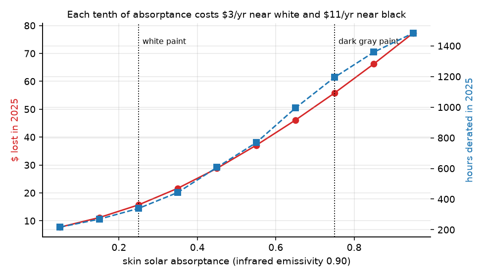
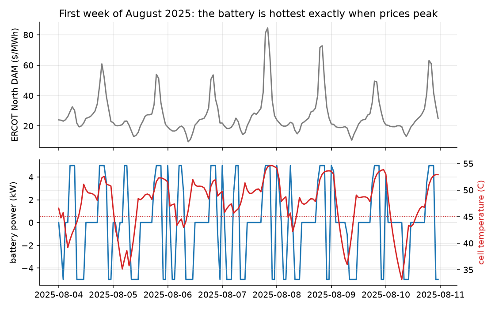
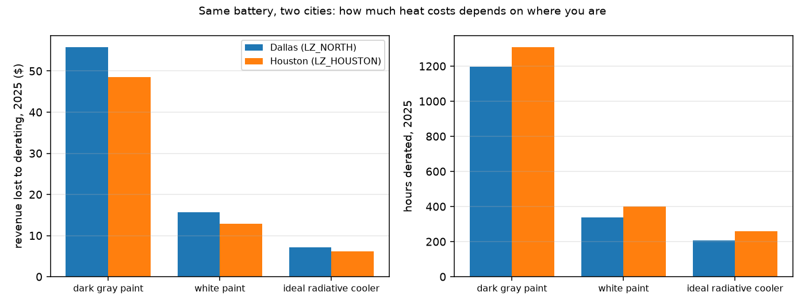
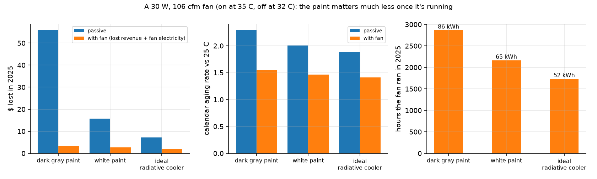
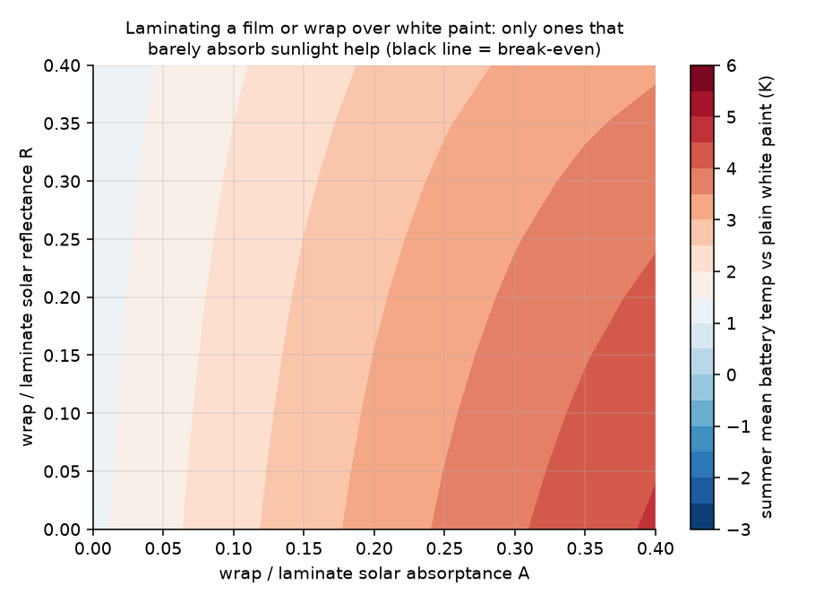
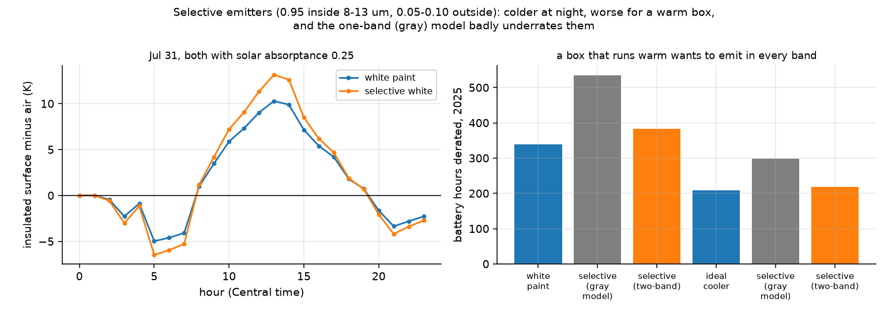
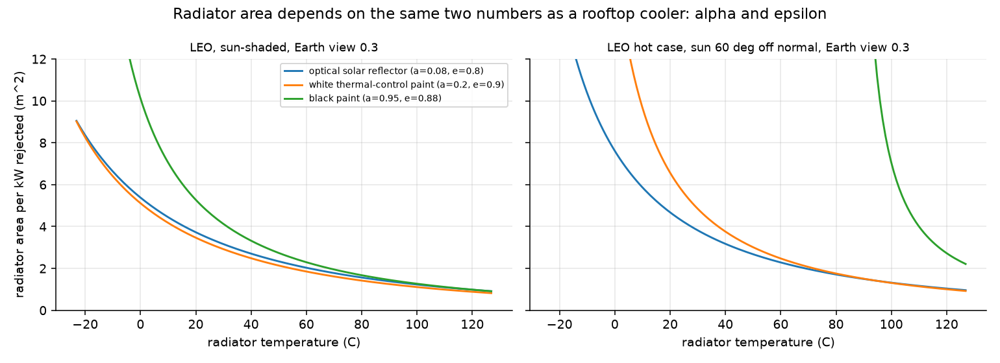
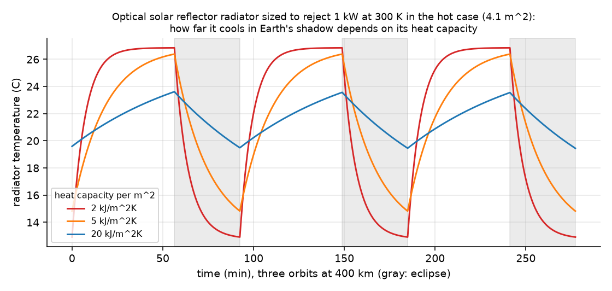

# radiant-thermal

[](https://github.com/aneeshkaravadi/radiant-thermal/actions/workflows/ci.yml)

Does the paint color of an outdoor home battery matter, in dollars? I live in North Texas, where batteries sit outside in summer sun and the grid's prices spike on the hottest afternoons, so I wanted to see whether those two things interact. They do.



## What I simulated

A generic 20 kWh, 5 kW battery in a passive outdoor enclosure, run through every hour of 2025 in Dallas. All of the inputs are real data:

- **weather:** hourly temperature, dew point, sunlight, wind and cloud cover from Open-Meteo
- **prices:** ERCOT's 2025 day-ahead prices for the North load zone, pulled with gridstatus

Each day a small linear program decides when to charge and discharge to make the most money. The enclosure is a two-node thermal model (the steel skin and the battery inside), and the skin trades heat with the sun, the sky and the air. When the cells pass 45 °C the battery management system starts cutting power, which means less to sell, so I feed that derating back into the dispatch and run it again.

## What came out

| Skin | Summer avg cell temp | Hours derated | Aging rate vs 25 °C | 2025 revenue |
|---|---|---|---|---|
| dark gray paint | 42.3 °C | 1,195 | 2.29× | $264 |
| white paint | 40.7 °C | 339 | 2.01× | $304 |
| ideal radiative cooler | 39.7 °C | 208 | 1.88× | $312 |

If the battery never had to derate it would make $319, so the dark box loses about $56 of that and the white box about $16. White paint is worth roughly $40 per battery per year here, plus 12% slower calendar aging, which isn't nothing across a fleet.

Sweeping the absorptance at the same emissivity shows the cost isn't linear. Each tenth of solar absorptance costs about $3 a year near white and $11 near black, because a darker box spends more of its hot hours derated. So dirt that takes a white box from 0.25 to 0.35 gives back about $6 of its advantage and adds about 100 derated hours.



The reason is easiest to see in one week of August: the cells are hottest right when prices peak, which is exactly when you most want the battery at full power.



## Dallas vs Houston

I reran everything for Houston with its own 2025 weather and its own ERCOT load-zone prices (`examples/compare_cities.py`). I expected Houston to be easier on the batteries, since its summer air was actually 0.7 °C cooler than Dallas's. It wasn't: the dark box derated for 1,308 hours against 1,195 in Dallas, and aged faster too. The difference is humidity. Houston's summer dew point averages 23.6 °C against 21.0 °C in Dallas, and water vapor closes the sky's infrared window, so the enclosure can't radiate heat away as well at night or during the day. Air temperature alone would have told the wrong story.



## Once there's a fan

Real units usually have fans, so I added one: about 100 cfm and 30 W. It switches on when the cells pass 35 °C and off below 32 °C, and only while the outside air is cooler than the cells, since blowing hotter air in would heat them up. That changes the answer. Every skin earns the full $319, because the cells almost never reach 45 °C anymore (2 hours for the dark box instead of 1,195). The paint now shows up mostly as fan time. The dark box ran its fan 2,863 hours (86 kWh, $3.40 at the same day-ahead prices), and the white box 2,162 hours (65 kWh, $2.64). White still ages a little slower, at 1.46 times the 25 °C rate against 1.55. In Houston the same fan runs 10 to 14% longer than in Dallas (2,457 hours against 2,162 for a white box), and its cells age faster too, so the humid nights from the last section show up as fan time instead of lost revenue.

I expected the fan to do most of its work at night, cooling the cells down while the air is cool, but it doesn't. The cells stay warmer than the air around the clock, so the dark box's fan runs most of the afternoon and evening, and only a third of its summer running is between 9 pm and 9 am.

So the paint matters a lot for a passive box and much less once there's a fan. For a fan-cooled unit, a white skin mostly buys a quarter less fan running.



## Wraps and laminates

I also expected that laminating a film or wrap over a white enclosure could help, and mostly it can't. Sunlight that passes through the film bounces between it and the paint, so I summed those bounces as a geometric series. The result is that on an opaque box, only a film that absorbs almost no sunlight beats plain white paint, and anything that absorbs UV or near-infrared makes it worse.



## Emitting only through the window

My skins were gray in the infrared, with one emissivity for every wavelength. But the sky is only partly transparent, mostly between 8 and 13 µm, and a lot of radiative-cooling research is about "selective" emitters that radiate strongly inside that window and reflect everywhere else. So I split the infrared into two bands, the window and everything else. Outside the window I treat the sky as black, and inside it I give the sky whatever emissivity keeps its total radiation equal to the Berdahl–Martin fit I was already using. That way a gray surface gets exactly the same answer as before, which the tests check, and only selective surfaces change.

A selective version of white paint (0.95 inside the window, 0.10 outside, same solar absorptance) shows the classic trade on the hottest day of 2025. As an insulated surface it gets 1.5 K colder than white paint before sunrise, but 2.8 K hotter at 1 pm. The battery box is warmer than the air most of the time, so it's on the wrong side of that trade: 383 hours derated against 339 for plain white paint.

The bigger surprise was how wrong the one-band model is for a surface like that. A total-emissivity measurement at room temperature would call the selective coating 0.37, and the gray model with 0.37 says it derates 535 hours, more than four times the real penalty. Knowing only a coating's total emissivity, you can't tell a good selective emitter from a poor emitter.



## Same equation, in orbit

A spacecraft radiator is the same energy balance with no atmosphere and no air, just sunlight, Earth's infrared and reflected sunlight coming in against $\varepsilon\sigma T^4$ going out. At 300 K in a hot low-Earth-orbit case, an optical solar reflector needs about 4.1 m² per kW, white paint 5.3, and black paint can't get rid of heat at all, which my first version reported as a literal infinity in the results file.



A radiator sized for the hot, sunlit case also has to live through eclipse. At 400 km an orbit takes 92 minutes, and 36 of them are in Earth's shadow, where nothing comes in but Earth's infrared. I followed an optical-solar-reflector radiator sized to reject 1 kW at 300 K in the hot case (4.1 m²) through a few orbits, with the electronics still putting their 1 kW into it in the shadow. It swings 14 K per orbit as a light panel (2 kJ/m²K of heat capacity) and 4 K with ten times that. The shadow geometry and the cooling are both checked against closed forms.



## Mistakes and fixes

- I first pulled the weather in local time while the ERCOT prices came timezone-aware, and around daylight saving those two don't line up hour for hour. Everything is in UTC now, and a test checks the two files match row for row.
- My first pass didn't feed derating back into dispatch, so it counted revenue the battery couldn't actually earn while it was hot.
- My first "energy balance" test only checked that the temperatures came out finite, which doesn't prove anything. I replaced it with one that holds the weather constant and checks that the battery settles exactly where the heat it conducts out equals the heat it generates.

## Running it

```bash
pip install -e ".[dev]"
pytest -q
python examples/make_figures.py
```

The enclosure numbers describe a generic unit, not anyone's product, so the differences between skins are the result, not the absolute temperatures. Assumptions and derivations are in [DERIVATIONS.md](DERIVATIONS.md), and data sources are in [data/README.md](data/README.md).

---

Aneesh Karavadi, dual-enrolled engineering student at UNT through TAMS. Separately from this repo, I'm an undergraduate researcher at UNT, testing transparent UV/IR-blocking radiative-cooling films. A window solar-heat-gain model would be a natural place to apply that kind of film here someday. I used Claude Code to write a lot of the implementation, but the questions and conclusions are mine.
